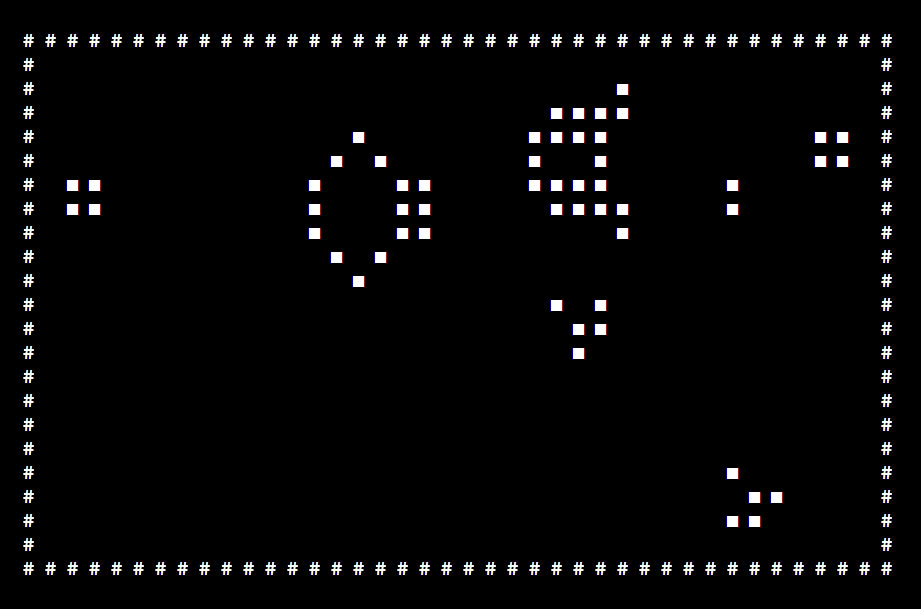
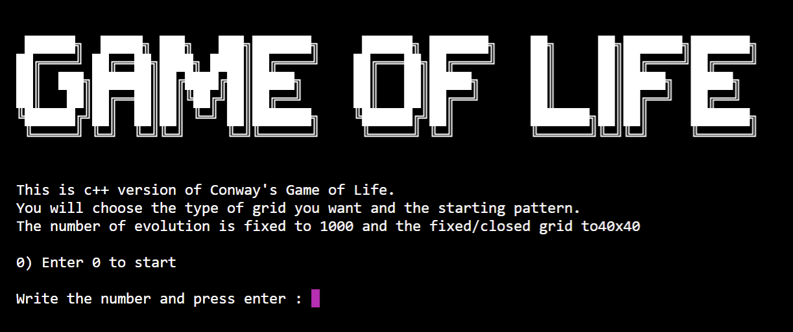
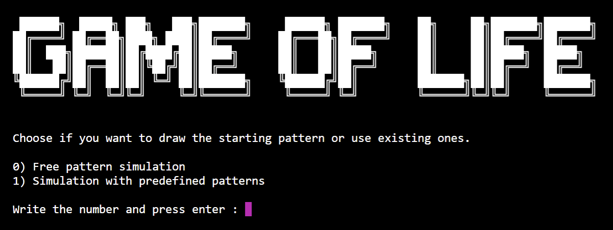
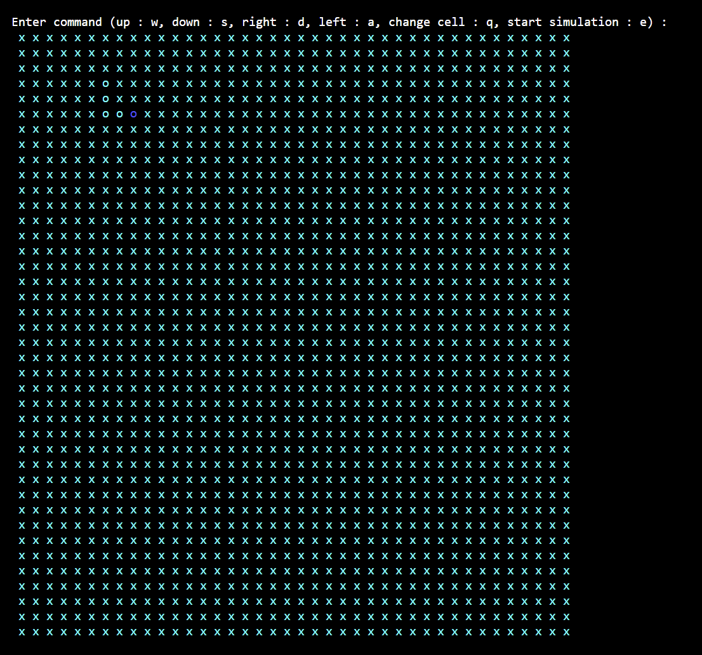
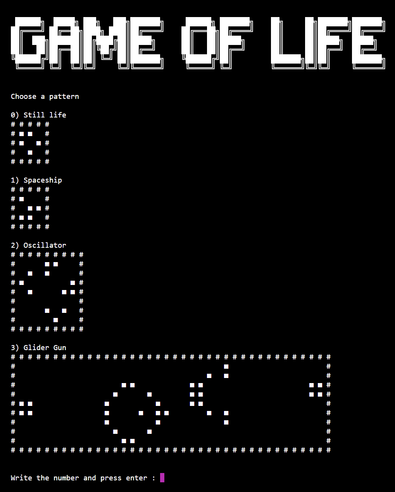
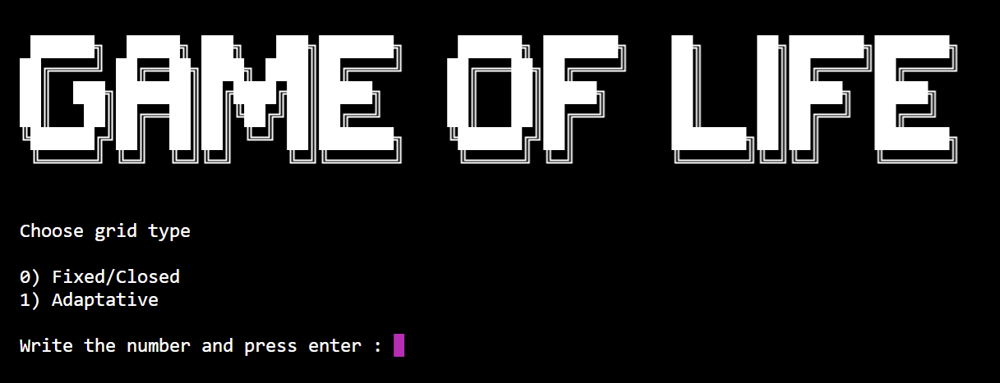
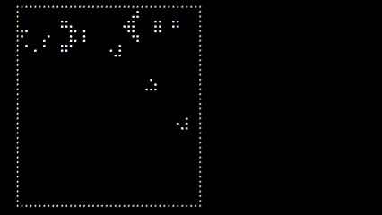
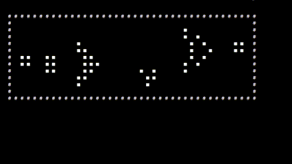

# Life : The Game of Life

## Description

The Game of Life, also known simply as Life, is a cellular automaton devised by the British mathematician John Horton
Conway in 1970. It is a zero-player game, meaning that its evolution is determined by its initial state, requiring no
further input. One interacts with the Game of Life by creating an initial configuration and observing how it evolves. It
is Turing complete and can simulate a universal constructor or any other Turing machine.

This project is a reproduction in C++ of the Game of Life. The user interface and output is in the console. This program
allows the user to make his/her own pattern or choose from a few suggested patterns. The user can also choose from two
types of grid representation

## Setup

### Requirement

* C++20
* Cmake 2.23 or newer
* Able to launch the executable in console

### Building and running

* Clone project
* Build program
* For better experience, launch program in terminal and put it in full screen, the quality of game output may differ
  depending on the terminal used

## Execution

For each menu, press the number in front of the option you want and press enter

### Starting screen

Press 0 and enter to start

### Initialise grid

You can choose if you want to draw the pattern by yourself or if you prefer to used suggested patterns to simulate.

**Free pattern simulation** : The dead cells are represented by an "x" and the alive cells by an "o", the current
selected cells is highlighted in darker blue. You can change the state of a cell and the current selected cell with the
indicated commands.

**Simulation with predefined patterns** : You can choose one pattern from the suggested patterns

### Grid type selection

**Fixed/closed** : The grid is of fixed size and closed on itself, meaning the cell of index (grid.size(),
grid.size()) = (-1, -1).

**Adaptative** : The grid grows or shrink to the minimum size that allows to see the
alive cells.

